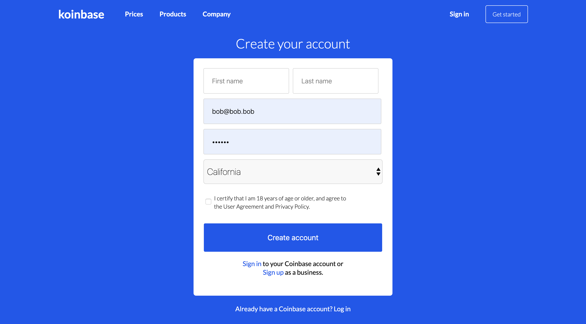
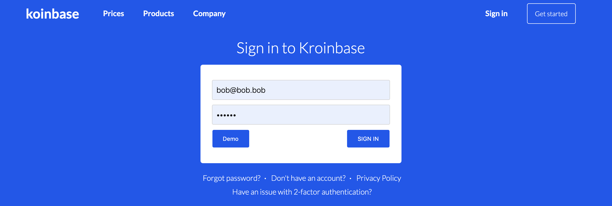

# Koinbase

## Summary

[Koinbase][Koinbase] is full stack single-page web application similar to Coinbase, one of the largest digital currency exchange. It's been built using using Ruby on Rails (version 6) and mainly React.js/Redux on the frontend. Koinbase is hosted on a Heroku server as of Jan. 10th 2020, here are the following main feature a users can do:

* Create an account
* Log in and out 
* Follow tradable crypto assets in real time
* Add and remove crypto assets from their personal watchlist
* Search a list of available crypto assets to follow
* View a graphic representation of these assets

Feel free to explore [Koinbase][Koinbase] or get in touch with me [here](#contact).
### Landing Page


## Overall Structure

### Hosting
The app is hosted on [Heroku][Heroku] as of Jan. 2020

### Database
The app is using [PostgreSQL][PostgreSQL] as its database.

### Back end 
The app relies on Ruby on Rails (v.6) on the back end with a postgreSQL database. The Back end is design to be RESTful complaint.

### Front end
The front end is built using in JavaScript and mainly the [React.js][React] and [Redux][Redux] framework.

### Libraries
Koinbase uses:
- [React.js][React]
- [Redux][Redux]
- [Recharts][Recharts]

## Features & Implementation
As stated Koinbase uses React/Redux on the frontend, so an obvious choice for navigating the app was to leverage the power of the React-Router library for the fontend routing. Let's explore the different routes and features more in depth:

### User Authentication
User authentication both for registration and sign up has been implemented using Bcrypt for hashing sensitive data and follows best practice such as not storing passwords to the database.

#### Registration 

Submit process

```
    handleSubmit(event) {
        event.preventDefault();
        const user = this.state;
        store.dispatch(signup(user))
            .then(()=>{ 
                loggedInUi();
                this.props.history.push('/dashboard');
        })
    }

```


#### Sign In

Demo function from the Sign in page

```
    handleDemo() {
        
        setTimeout(() => {

            const emailField = document.getElementById('email').value = 'demo@demo.demo';
            const password = document.getElementById('password').value = 'password';
            const sub = document.getElementById('sub');
            sub.click();
        }
            , 2000);

    }
```



### Dashboard 
On a successful sign up/sign in, a user will be directed to his dashboard where he will be able to view a graphical representation of the evolution of his followed crypto assets (or the 6 most popular ones if it is his first sign in on the platform) over a set period of time.
<!---
#### How the graphs work ?
* An API call is made with Axios? to retrieve historical data from several market places. Data are then formatted and stored in the redux store for persistance.
* Chartjs Library is then provided with these data to built a graph of the price evolution over time.
--->

#### Dashboard

Dashboard's Card Element
```
render() {
        const arr = [BTC,BCH,ETH,XLM,EOS,XRP];
        const arr_double = ['BTC', 'BCH', 'ETH', 'XLM', 'EOS', 'XRP'];
        const idx = (arr_double.indexOf(this.props.symbol) !== -1) ? arr_double.indexOf(this.props.symbol) : 1; 
        const divRed = {color:'red'};
        const divGreen = { color:'green' };
        const percentIsPos = (this.props.percentage>0);
                
        return (
                        <>                
                        <div className="card-container"> 
                        
                            <div className="card-sub-info">
                                <div>
                                    
                                    <span className='card-name'>{this.props.name}</span>
                                </div>
                                <div>{this.props.time}</div>
                            </div>
                        
                            <div className='card-sub-info'>
                                <div className='card-price'>${this.props.price.toFixed(2)}</div>
                                <div style={percentIsPos ? divGreen : divRed }>{this.props.percentage.toPrecision(2)}%</div>
                            </div> 
                        
                            <div className="card-chart">
                                {SimpleLineChart()}
                        
                            </div>
                        </div>
                        </>
                )
    }
```


### Price Component
The price component contains the list of all assets. They are searchable by name and the star icon allows users to add them on their watchlist.

#### Search 
The Search was built using plain JavaScript. 
```

const handleSearch = (event) => {
   
    let assets = document.querySelectorAll('.price-element-border');
    let input = event.target.value.toUpperCase();

    assets.forEach((crypto) => {
        
        if(crypto.textContent.toUpperCase().indexOf(input) > -1){
            crypto.style.display = '';
        }else{
            crypto.style.display = 'none'; 
        }
    });
}
```


#### Follow
How stars are changed once followed
```
    star = () =>{
        const followed = {
            color: '#F4C623',
        };
        const style = {
            color: 'grey',
        }
        
        if (Object.keys(this.props.wallets).includes(this.props.symbol)){
            return followed;
        }else{
            return style;
        }
    }

```


## Future Improvements:

* [ ] Host on AWS using Docker
* [ ] fully refactor for higher scalability
* [ ] Audit for better security and best practice

## Feedbacks and Questions <a id="contact"></a>

Feel free to reach out if you have any questions, critiques or feedbacks you'd like to share, it is always appreciated.
my [email](mailto:bobandredev@gmail.com)


[Koinbase]: http://www.easynametoremember.herokuapp.com/
[Heroku]: https://www.heroku.com/
[PostgreSQL]: https://www.postgresql.org/
[Recharts]:http://recharts.org/en-US/
[React]:https://facebook.github.io/react/
[Redux]:https://redux.js.org/
